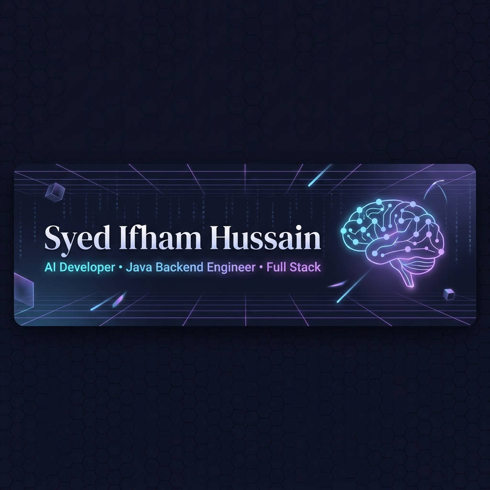

<div align="center">

<!-- ════════════════════════════════════════════════════════════════ -->
<!--                        HERO SECTION                            -->
<!-- ════════════════════════════════════════════════════════════════ -->



<br/>

<!-- Typing SVG Animation -->
[](https://git.io/typing-svg)

<br/>

<!-- Animated tagline -->
[](https://git.io/typing-svg)

<br/>

<!-- Social Badges -->
<a href="https://github.com/ifhamahmed">
  
</a>
<a href="https://linkedin.com/in/ifhamahmed">
  
</a>
<a href="https://leetcode.com/ifhamahmed">
  
</a>
<a href="mailto:ifhamahmed@email.com">
  
</a>

<br/><br/>

<!-- Visitor Counter -->


</div>


<!-- ════════════════════════════════════════════════════════════════ -->
<!--                       ABOUT ME SECTION                         -->
<!-- ════════════════════════════════════════════════════════════════ -->

<div align="center">
<h2>
  
  &nbsp;About Me&nbsp;
  
</h2>
</div>

<table align="center" width="90%">
<tr>
<td width="55%" valign="top">

```yaml
name: Ifham Ahmed
located_in: India 🇮🇳
current_role: AI Developer & Full Stack Engineer
education: Computer Science & Engineering

passion:
  - Building AI-powered applications
  - Java & Spring Boot microservices
  - Cloud-native architecture
  - Competitive programming
  - Contributing to open source

current_focus:
  - LLM Engineering & RAG Systems
  - Kubernetes & Cloud Orchestration
  - System Design Mastery
  - DSA & Competitive Programming

fun_fact: "I debug code faster than I debug my life 😄"
open_to: Collaborations, Internships & Full-time roles
```

</td>
<td width="45%" align="center" valign="top">


</td>
</tr>
</table>


<!-- ════════════════════════════════════════════════════════════════ -->
<!--                    CURRENT FOCUS SECTION                       -->
<!-- ════════════════════════════════════════════════════════════════ -->

<div align="center">
<h2>🎯 Current Focus</h2>

<table>
<tr>
<td align="center" width="25%">
  <br/>
  <strong>AI/ML Engineering</strong><br/>
  <sub>LLM, RAG, LangChain</sub>
</td>
<td align="center" width="25%">
  <br/>
  <strong>Java Backend</strong><br/>
  <sub>Spring Boot, Microservices</sub>
</td>
<td align="center" width="25%">
  <br/>
  <strong>Cloud & K8s</strong><br/>
  <sub>AWS, Docker, Kubernetes</sub>
</td>
<td align="center" width="25%">
  <br/>
  <strong>Competitive Programming</strong><br/>
  <sub>DSA, Algorithms</sub>
</td>
</tr>
</table>

</div>


<!-- ════════════════════════════════════════════════════════════════ -->
<!--                      TECH STACK SECTION                        -->
<!-- ════════════════════════════════════════════════════════════════ -->

<div align="center">
<h2>
  
  &nbsp;Tech Stack
</h2>

### 🔤 Languages


### 🎨 Frontend


### ⚙️ Backend


### 🗄️ Databases


### ☁️ Cloud & DevOps


### 🤖 AI & ML


<a href="https://www.langchain.com">
  
</a>

### 🛠️ Developer Tools


</div>


<!-- ════════════════════════════════════════════════════════════════ -->
<!--                    GITHUB STATS SECTION                        -->
<!-- ════════════════════════════════════════════════════════════════ -->

<div align="center">
<h2>
  📊 GitHub Analytics
</h2>

<br/>

<!-- Row 1: Stats + Streak -->
<table width="100%">
<tr>
<td width="50%" align="center">

[](https://github.com/ifhamahmed)

</td>
<td width="50%" align="center">

[](https://git.io/streak-stats)

</td>
</tr>
</table>

<br/>

<!-- Row 2: Top Languages -->
[](https://github.com/ifhamahmed)

<br/>

<!-- GitHub Trophies -->
<h3>🏆 GitHub Trophies</h3>

[](https://github.com/ryo-ma/github-profile-trophy)

</div>


<!-- ════════════════════════════════════════════════════════════════ -->
<!--                   CONTRIBUTION GRAPH                           -->
<!-- ════════════════════════════════════════════════════════════════ -->

<div align="center">
<h2>📈 Contribution Activity</h2>

[](https://github.com/ashutosh00710/github-readme-activity-graph)

<br/>

<!-- Contribution Heatmap via ghchart -->
<h3>📅 Contribution Heatmap</h3>


</div>


<!-- ════════════════════════════════════════════════════════════════ -->
<!--                    SNAKE ANIMATION                             -->
<!-- ════════════════════════════════════════════════════════════════ -->

<div align="center">
<h2>🐍 Snake Eating My Contributions</h2>

<picture>
  <source media="(prefers-color-scheme: dark)" srcset="https://raw.githubusercontent.com/ifhamahmed/ifhamahmed/output/github-contribution-grid-snake-dark.svg"/>
  <source media="(prefers-color-scheme: light)" srcset="https://raw.githubusercontent.com/ifhamahmed/ifhamahmed/output/github-contribution-grid-snake.svg"/>
  
</picture>

</div>


<!-- ════════════════════════════════════════════════════════════════ -->
<!--                    GITHUB METRICS SECTION                      -->
<!-- ════════════════════════════════════════════════════════════════ -->

<div align="center">
<h2>📋 GitHub Metrics Dashboard</h2>


> *Metrics auto-update daily via GitHub Actions*

</div>


<!-- ════════════════════════════════════════════════════════════════ -->
<!--                    FEATURED PROJECTS SECTION                   -->
<!-- ════════════════════════════════════════════════════════════════ -->

<div align="center">
<h2>
  🚀 Featured Projects
</h2>
<p><em>Building the future, one commit at a time</em></p>
</div>

<table align="center" width="92%">
<tr>

<!-- Project 1: Ubuntu AI Assistant -->
<td width="50%" valign="top">
<div align="center">

### 🤖 Ubuntu AI Assistant
**AI-powered command-line assistant for Ubuntu Linux**

[](https://github.com/ifhamahmed/ubuntu-ai-assistant)
[](https://github.com/ifhamahmed/ubuntu-ai-assistant)


*Natural language interface for Linux commands, automated system management using LLMs and RAG architecture.*

[](https://github.com/ifhamahmed/ubuntu-ai-assistant)

</div>
</td>

<!-- Project 2: Impact AI -->
<td width="50%" valign="top">
<div align="center">

### 💡 Impact AI
**Intelligent business analytics & insights platform**

[](https://github.com/ifhamahmed/impact-ai)
[](https://github.com/ifhamahmed/impact-ai)


*AI-powered platform that transforms raw business data into actionable insights using deep learning models.*

[](https://github.com/ifhamahmed/impact-ai)

</div>
</td>

</tr>
<tr>

<!-- Project 3: FlowTrace -->
<td width="50%" valign="top">
<div align="center">

### 🔍 FlowTrace
**Distributed tracing & observability platform**

[](https://github.com/ifhamahmed/flowtrace)
[](https://github.com/ifhamahmed/flowtrace)


*Microservices-grade distributed tracing solution with real-time monitoring, alerting, and performance analytics.*

[](https://github.com/ifhamahmed/flowtrace)

</div>
</td>

<!-- Project 4: AI Financial Advisor -->
<td width="50%" valign="top">
<div align="center">

### 💹 AI Financial Advisor
**Intelligent personal finance management**

[](https://github.com/ifhamahmed/ai-financial-advisor)
[](https://github.com/ifhamahmed/ai-financial-advisor)


*ML-powered financial advisor providing personalized investment strategies and portfolio optimization using predictive models.*

[](https://github.com/ifhamahmed/ai-financial-advisor)

</div>
</td>

</tr>
<tr>

<!-- Project 5: Portfolio Website -->
<td width="50%" valign="top">
<div align="center">

### 🌐 Portfolio Website
**Premium developer portfolio with 3D animations**

[](https://ifhamahmed.dev)
[](https://github.com/ifhamahmed/portfolio)


*Full-stack portfolio with Three.js 3D animations, glassmorphism design, and real-time GitHub integration.*

[](https://ifhamahmed.dev)

</div>
</td>

<!-- Project 6: DSA Repository -->
<td width="50%" valign="top">
<div align="center">

### 📚 DSA Repository
**Comprehensive Data Structures & Algorithms**

[](https://github.com/ifhamahmed/dsa-solutions)
[](https://github.com/ifhamahmed/dsa-solutions)


*500+ DSA problems solved across LeetCode, Codeforces, and HackerRank with detailed explanations and time complexity analysis.*

[](https://github.com/ifhamahmed/dsa-solutions)

</div>
</td>

</tr>
</table>


<!-- ════════════════════════════════════════════════════════════════ -->
<!--                  COMPETITIVE PROGRAMMING                       -->
<!-- ════════════════════════════════════════════════════════════════ -->

<div align="center">
<h2>🏆 Competitive Programming</h2>

<table>
<tr>
<td align="center" width="33%">
  <a href="https://leetcode.com/ifhamahmed">
    
  </a><br/>
  <strong>500+ Problems Solved</strong><br/>
  <sub>Algorithms & Data Structures</sub>
</td>
<td align="center" width="33%">
  <a href="https://codeforces.com/profile/ifhamahmed">
    
  </a><br/>
  <strong>Active Contestant</strong><br/>
  <sub>Competitive Programming</sub>
</td>
<td align="center" width="33%">
  <a href="https://www.hackerrank.com/ifhamahmed">
    
  </a><br/>
  <strong>5 Star Problem Solver</strong><br/>
  <sub>Algorithms & Java</sub>
</td>
</tr>
</table>

</div>


<!-- ════════════════════════════════════════════════════════════════ -->
<!--                    LEARNING ROADMAP                            -->
<!-- ════════════════════════════════════════════════════════════════ -->

<div align="center">
<h2>🗺️ Current Learning Journey</h2>

```
2025 ──────────────────────────────────────────────────────────────── 2026
  │                                                                      │
  ├── ✅ Spring Boot Microservices                                       │
  ├── ✅ Docker & Container Orchestration                                │
  ├── ✅ LangChain & RAG Architecture                                    │
  ├── 🔄 Advanced Kubernetes (In Progress)                              │
  ├── 🔄 AWS Solutions Architect                                        │
  ├── 📅 LLM Fine-tuning & Agents                                       │
  ├── 📅 System Design (Large-scale)                                    │
  └── 📅 CNCF Certifications (CKA / CKAD)                              │
                                                                         │
Legend: ✅ Completed | 🔄 In Progress | 📅 Planned
```

</div>


<!-- ════════════════════════════════════════════════════════════════ -->
<!--                       ACHIEVEMENTS                             -->
<!-- ════════════════════════════════════════════════════════════════ -->

<div align="center">
<h2>🎖️ Achievements & Highlights</h2>

<table>
<tr>
<td align="center">
  
</td>
<td align="center">
  
</td>
<td align="center">
  
</td>
</tr>
<tr>
<td align="center">
  
</td>
<td align="center">
  
</td>
<td align="center">
  
</td>
</tr>
</table>

</div>


<!-- ════════════════════════════════════════════════════════════════ -->
<!--                    OPEN SOURCE SECTION                         -->
<!-- ════════════════════════════════════════════════════════════════ -->

<div align="center">
<h2>🌐 Open Source Philosophy</h2>

```
"Open source is not just about code.
 It's about community, learning, and giving back."
                                         — Ifham Ahmed
```

<br/>


</div>


<!-- ════════════════════════════════════════════════════════════════ -->
<!--                    DEVELOPER QUOTE                             -->
<!-- ════════════════════════════════════════════════════════════════ -->

<div align="center">
<h2>💭 Developer Wisdom</h2>

[](https://github.com/piyushsuthar/github-readme-quotes)

</div>


<!-- ════════════════════════════════════════════════════════════════ -->
<!--                    GITHUB ACTIVITY FEED                        -->
<!-- ════════════════════════════════════════════════════════════════ -->

<div align="center">
<h2>⚡ Recent GitHub Activity</h2>

<!--START_SECTION:activity-->
<!-- This section is auto-updated by GitHub Actions after first workflow run -->
<!--END_SECTION:activity-->

</div>


<!-- ════════════════════════════════════════════════════════════════ -->
<!--                      CONNECT SECTION                           -->
<!-- ════════════════════════════════════════════════════════════════ -->

<div align="center">
<h2>🤝 Let's Connect</h2>
<p><em>Always open to interesting conversations and collaboration opportunities!</em></p>

<br/>

<a href="https://github.com/ifhamahmed">
  
</a>
&nbsp;
<a href="https://linkedin.com/in/ifhamahmed">
  
</a>
&nbsp;
<a href="https://ifhamahmed.dev">
  
</a>
&nbsp;
<a href="https://leetcode.com/ifhamahmed">
  
</a>

<br/><br/>

<a href="https://codeforces.com/profile/ifhamahmed">
  
</a>
&nbsp;
<a href="mailto:ifhamahmed@email.com">
  
</a>
&nbsp;
<a href="https://twitter.com/ifhamahmed">
  
</a>

<br/><br/>

<!-- Animated call to action -->
[](https://git.io/typing-svg)

</div>

<!-- ════════════════════════════════════════════════════════════════ -->
<!--                      FOOTER SECTION                            -->
<!-- ════════════════════════════════════════════════════════════════ -->

<br/>


<div align="center">

<sub>
  Made with love by <a href="https://github.com/ifhamahmed"><strong>Ifham Ahmed</strong></a>
  &nbsp;•&nbsp;
  Auto-updated by <a href=".github/workflows/">GitHub Actions</a>
  &nbsp;•&nbsp;
  Last updated: 2026
</sub>

<br/><br/>


</div>
"# syed-ifham" 
