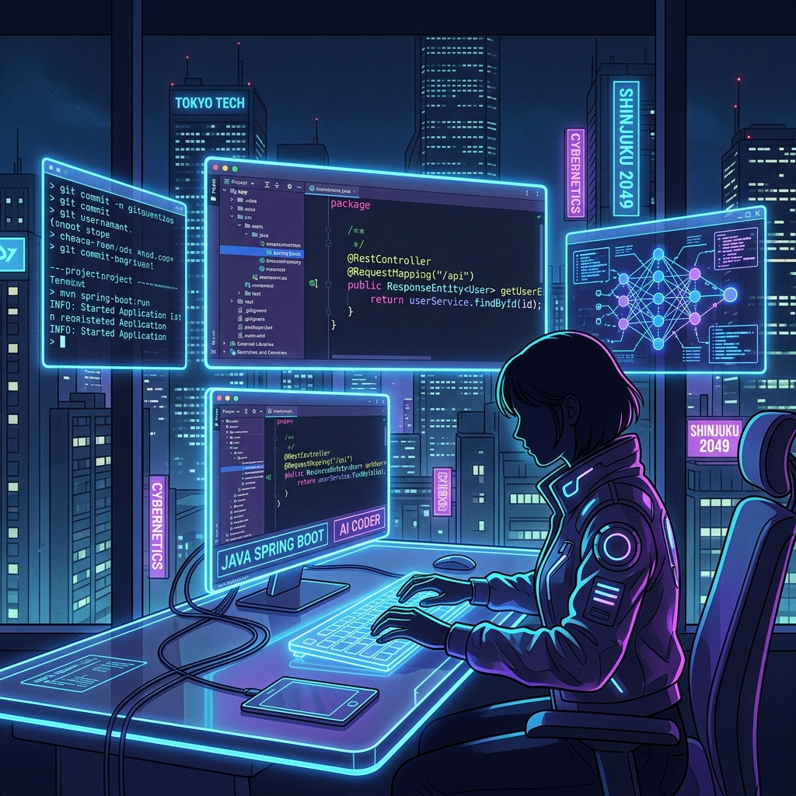

<div align="center">

<br/>

<!-- Typing SVG Animation -->
[](https://git.io/typing-svg)

<br/>

<!-- Animated tagline -->
[](https://git.io/typing-svg)

<br/>

<!-- Social Badges -->
<a href="https://github.com/syed-ifham">
  
</a>
<a href="https://linkedin.com/in/syedifham">
  
</a>
<a href="https://leetcode.com/ifham786">
  
</a>
<a href="mailto:syedifham300@gmail.com">
  
</a>

<br/>

<!-- Visitor Counter -->
<!--  -->

</div>


<!-- ════════════════════════════════════════════════════════════════ -->
<!--                       ABOUT ME SECTION                         -->
<!-- ════════════════════════════════════════════════════════════════ -->

<div align="center">
<h2>
  
  &nbsp;About Me&nbsp;
  
</h2>
</div>

<table align="center" width="90%">
<tr>
<td width="55%" valign="top">

```yaml
name: Syed Ifham Hussain
located_in: India 🇮🇳
current_role: AI Developer & Full Stack Engineer
education: Computer Science & Engineering

passion:
  - Building AI-powered applications
  - Java & Spring Boot microservices
  - Cloud-native architecture
  - Contributing to open source

current_focus:
  - LLM Engineering & RAG Systems
  - Kubernetes & Cloud Orchestration
  - System Design 
  - DSA & Competitive Programming
```

</td>
<td width="45%" align="center" valign="top">
<br/>

<br/>
</td>
</tr>
</table>


<!-- ════════════════════════════════════════════════════════════════ -->
<!--                    CURRENT FOCUS SECTION                       -->
<!-- ════════════════════════════════════════════════════════════════ -->

<div align="center">
<h2>🎯 Current Focus</h2>

<table>
<tr>
<td align="center" width="25%">
  <br/>
  <strong>AI/ML Engineering</strong><br/>
  <sub>LLM, RAG, LangChain</sub>
</td>
<td align="center" width="25%">
  <br/>
  <strong>Java Backend</strong><br/>
  <sub>Spring Boot, Microservices</sub>
</td>
<td align="center" width="25%">
  <br/>
  <strong>Cloud & K8s</strong><br/>
  <sub>AWS, Docker, Kubernetes</sub>
</td>
<td align="center" width="25%">
  <br/>
  <strong>Competitive Programming</strong><br/>
  <sub>DSA, Algorithms</sub>
</td>
</tr>
</table>

</div>


<!-- ════════════════════════════════════════════════════════════════ -->
<!--                      TECH STACK SECTION                        -->
<!-- ════════════════════════════════════════════════════════════════ -->

<div align="center">
<h2>
  
  &nbsp;Tech Stack
</h2>

### 🔤 Languages


### 🎨 Frontend


### ⚙️ Backend


### 🗄️ Databases


### ☁️ Cloud & DevOps


### 🤖 AI & ML


<a href="https://www.langchain.com">
  
</a>

### 🛠️ Developer Tools


</div>


<div align="center">

<sub>
  Made with love by <a href="https://github.com/syed-ifham"><strong>Syed Ifham Hussain</strong></a>
  &nbsp;•&nbsp;
  Auto-updated by <a href=".github/workflows/">GitHub Actions</a>
  &nbsp;•&nbsp;
  Last updated: 2026
</sub>
</div>
